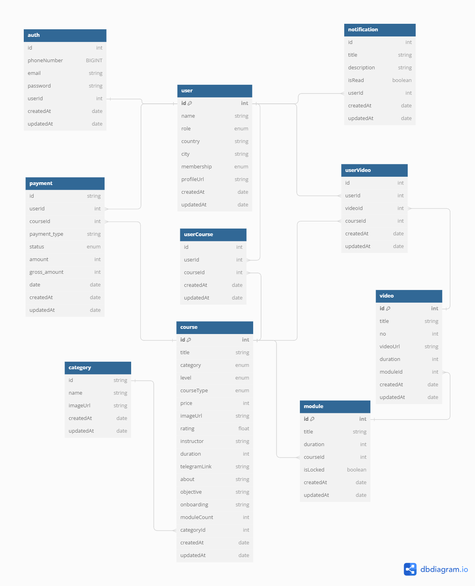

# Project Title 📛

Learn-Hub Backend API🚀

## Demo link: 🔗

After completing the project, we deployed the backend application using Railway with its API domain to view our API documentation: [Learn-Hub API](https://api-learnhub.up.railway.app/api-docs)
\*The project production server will stop at the end of the bootcamp period.😀

## Table of Content: 📑

- [About The App](#about-the-app)
- [Screenshots](#screenshots)
- [Some Technologies that we use](#some-technologies-that-we-use)
- [Setup](#setup)
- [Approach](#approach)
- [Status](#status)
- [Credits](#credits)

## About The App

We are the FSW C-10 team 👩‍💻, we collaborate with the Android team to develop this backend application which our Android teams and FSW frontend teams will later consume. We use Trello to collaborate and managing task 📆, and we follow Agile and Scrum methodologies for our work process 🏋🏻‍♂️.

The project focuses on a Massive Open Online Course theme and is designed for two types of users - the admin and the user 🙎🙎‍♂️. There are two types of courses available in the system, namely free 🆓 and premium courses 💸. The admin is responsible for managing both types of courses while users have the option to enroll in free courses or purchase premium courses using different payment methods such as bank transfer, Alfamart, Indomart, as well as digital wallets like Dana, OVO, and any others payment methods. \*we use midtrans for payment gateway 💳

This system includes a progress tracking feature that allows users to view the percentage 💯 of their progress as they watch courses they have either enrolled in or purchased. Additionally, the system provides a one-time-password (OTP) 🔢 feature for user registration and password resetting. Furthermore, there is also a notification feature that users can enable to stay updated on any important announcements. And any other feature are on these project, Lets Try it by yourself ✨ [Setup](#setup)

## Screenshots

- Database Diagram 📷
  

## Some Technologies that we use

               

## Setup

- setup and installation 💻
- download or clone the repository
- run `npm install`
- configurete env variable by env.example
- run `npm run db:create`
- run `npm run db:migrate`
- run `npm run db:seed`
- run `npm run dev`
- success run the server 🖥️
- to view the API documentation, please open the project on localhost and access the /api-docs endpoint

## Approach

We follow the eslint airbnb rules 📝 for writing code, use single quotes for strings, and avoid colons for code endings. And we implement the `MVC` design pattern.🚶

## Status

Since the Learn-Hub backend API has been completed 🎉. We want to identify additional features that can be added to the project in the future. The project's production server 📶 will remain active until the bootcamp period is over ⌛.

## Credits

List of contributors 👨‍💻:

- [Imam Taufiqh Hermawan 🧑](https://github.com/ImamTaufiqHermawan)
- [Arif Gilang Pradana 👨](https://github.com/Agiprada)
- [Adrian Wahyu Prasetya 👦](https://github.com/rianwp)
- [Muhammad Nur Fajri 👨‍🦱](https://github.com/fajri900)
- [Arfiano Jordhy Ramadhan 🧒](https://github.com/ukinon)
- [Dimas Mukhtar Yuliawan 🧑‍🦱](https://github.com/dimsmukhtar)
